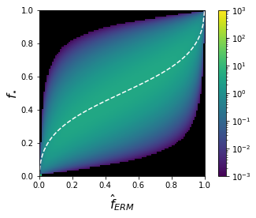
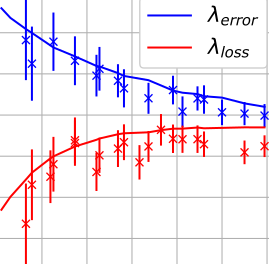

Companion code for the paper [Theoretical characterization of uncertainty in high-dimensional linear classification](http://arxiv.org/abs/2202.03295)

### Usage 

The required packages are listed in `requirements.txt`

The folder Code/experiments contains two jupyter notebook that reproduce each one figure of the paper : 
* `lambda-fixed-experiments.ipynb` plots the joint density of the uncertainties of Logistic regression / Bayes, and Logistic regression / Teacher (both theoretical prediction and experimental estimation)
* `lambda-min-error-experiments.ipynb` plots the calibration of ERM at a fixed level, as a function of the sampling ratio.
